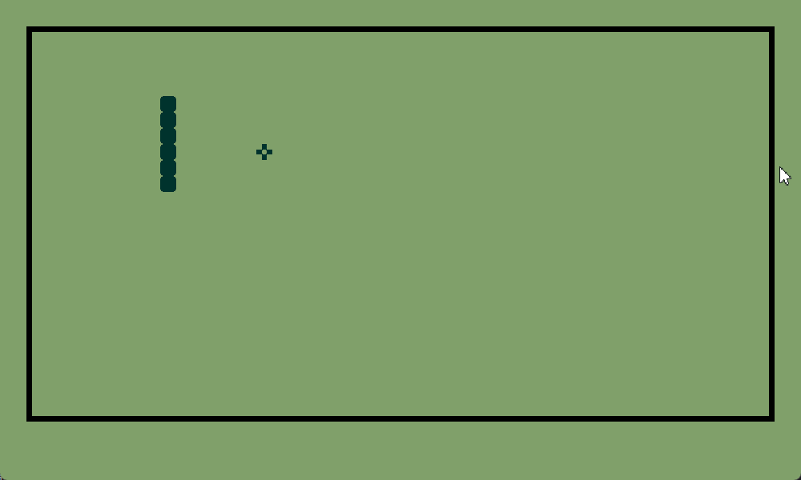

# retro-style snake game 

written in [raylib](https://github.com/raysan5/raylib) (using [raylib-go](https://github.com/gen2brain/raylib-go))

gameplay so far 

## todo

- [x] basic movement mechanics
- [x] eating food grows the snake
- [x] hitting border kills
- [x] eating self kills
- [ ] more food at the same time
- [ ] display:
  - [ ] difficulty
  - [x] score
  - [x] max score
  - [x] game title
- [ ] intro menu
  - [ ] current high score
  - [ ] difficulty (slug, worm, python)
  - [ ] game logo?
- [ ] different types of items
  - [ ] poison
- [ ] better snake animation?
- [ ] music?

Reference image used so far (credit: https://metro.co.uk):

## Font

I am using the Minecraft font which is 100% free, you can find the Minecraft font here: https://www.dafont.com/minecraft.font